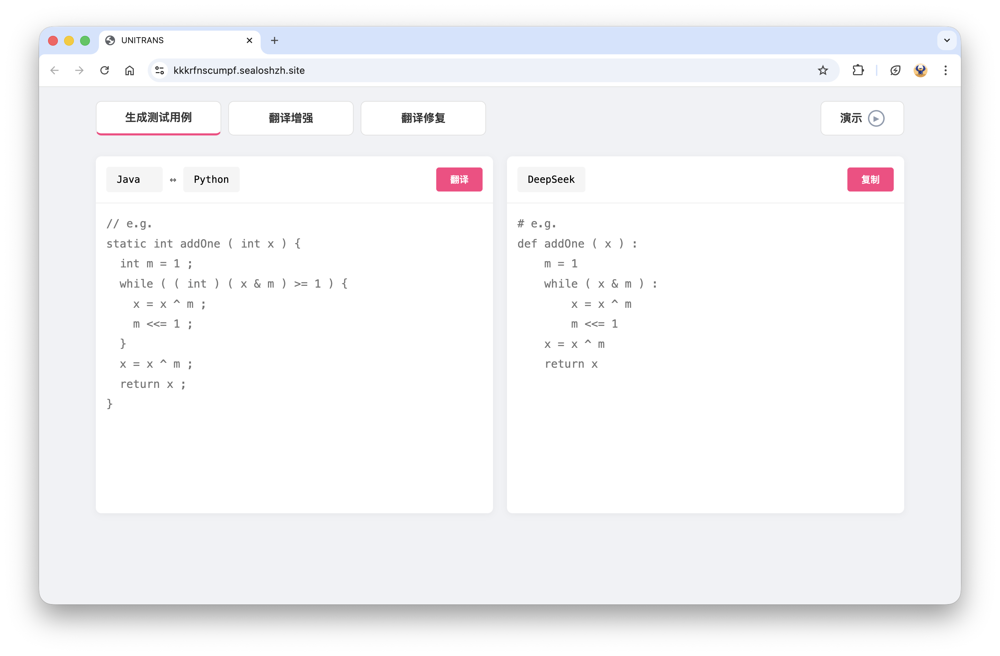
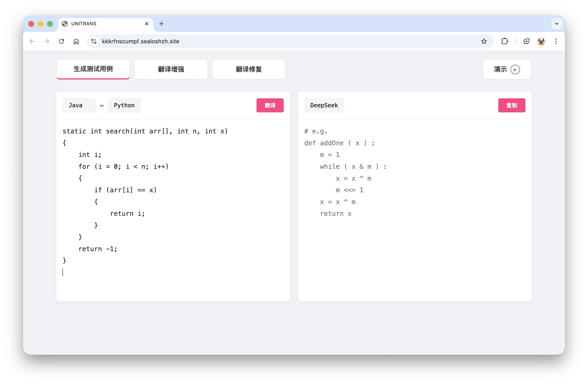
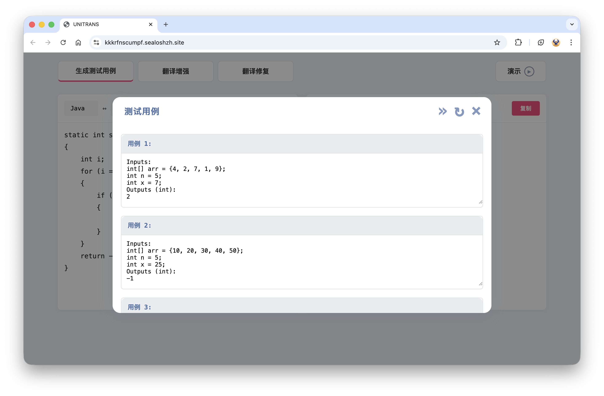
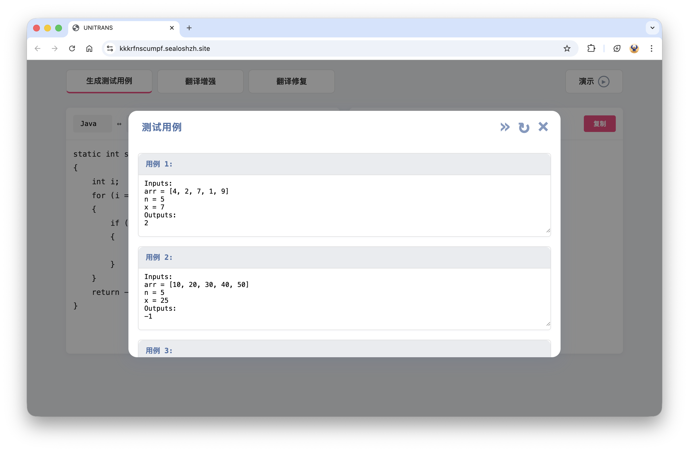
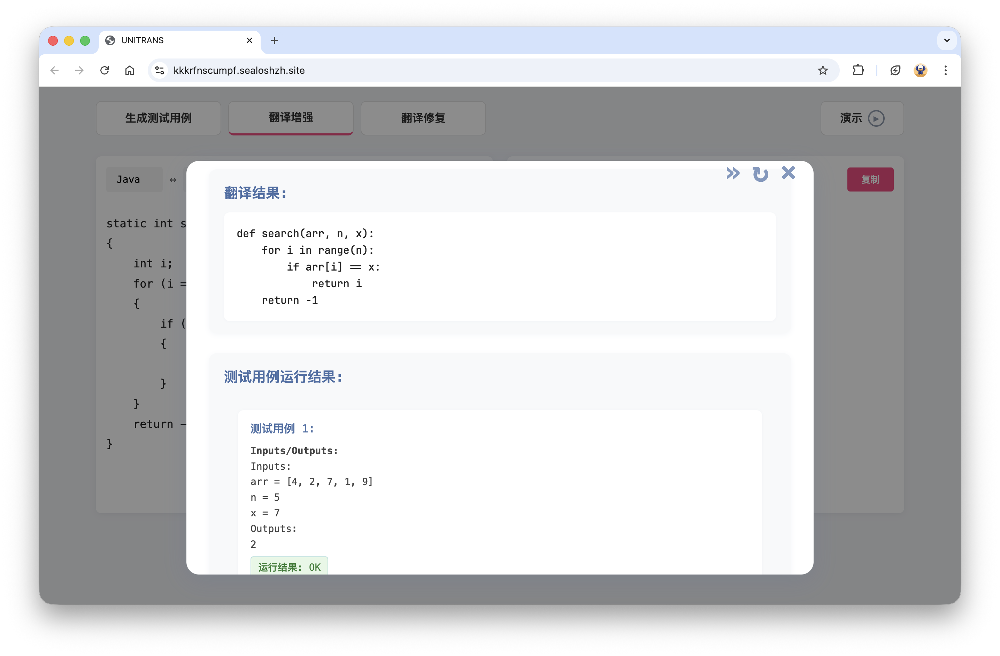
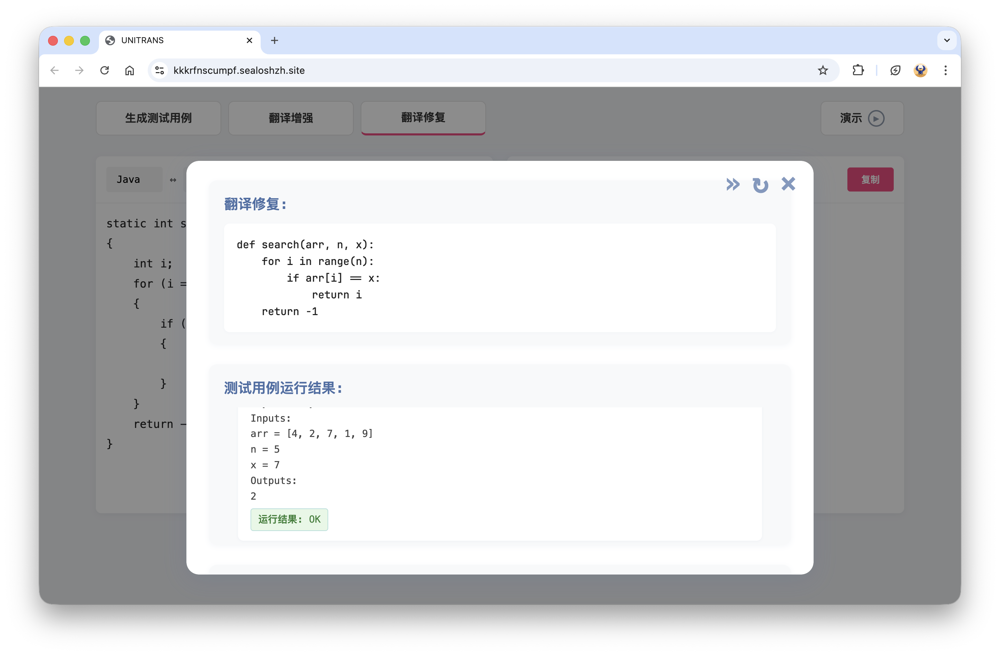
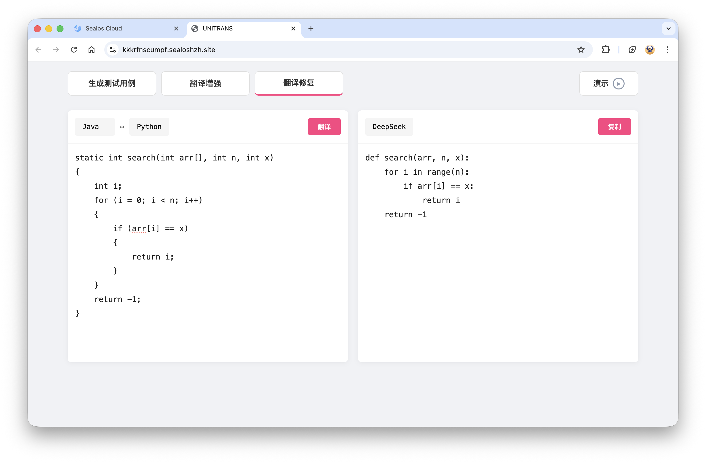

# Exploring and Unleashing the Power of Large Language Models in Automated Code Translation

## Preparation

```commandline
jdk17
python 3.9.21
flask 3.1.0
openai 1.60.1
javafx-sdk-20  # 参考 https://openjfx.io/openjfx-docs/#introduction
Stack BackTrace for C++: https://github.com/NEWPLAN/newplan_toolkit/backtrace
```

## Quick Start

### 1. 环境激活与程序输入

- **激活 Flask 环境**

  

- **输入待翻译程序，选择源语言和目标语言**

  

### 2. 测试用例生成阶段

- 点击“翻译”按钮，自动生成测试用例(若测试用例生成失败，可点击右上角 ↻ 重新生成)

  

- 可根据目标语言手动修改生成的测试用例

  - **Python 测试用例格式示例：**
    ```
    Inputs:
    Variable1 = Data1
    Variable2 = Data2
    ...
    Outputs:
    result1
    result2
    ...
    ```
  - **C++/Java 测试用例格式示例：**
    ```
    Inputs:
    type variable1 = value1 ;
    type variable2 = value2 ;
    ...
    Outputs (return_type):
    result1
    result2
    ...
    ```

- 手动修改后的测试用例示意：

  

### 3. 翻译增强阶段

- 点击右上角 → 进行翻译增强

  

- 检查翻译程序是否通过所有测试用例

- 若全部通过，点击右上角 ✖ 结束翻译；如有未通过的测试用例，进入下一步

### 4. 翻译修复阶段

- 点击右上角 → 进行翻译修复

  

- 在翻译修复界面可查看修复后的代码及测试用例结果。对于仍未通过的用例，可多次点击 ↻ 进行修复

- 若修复通过，点击右上角 ✖ 结束翻译。

  

---
